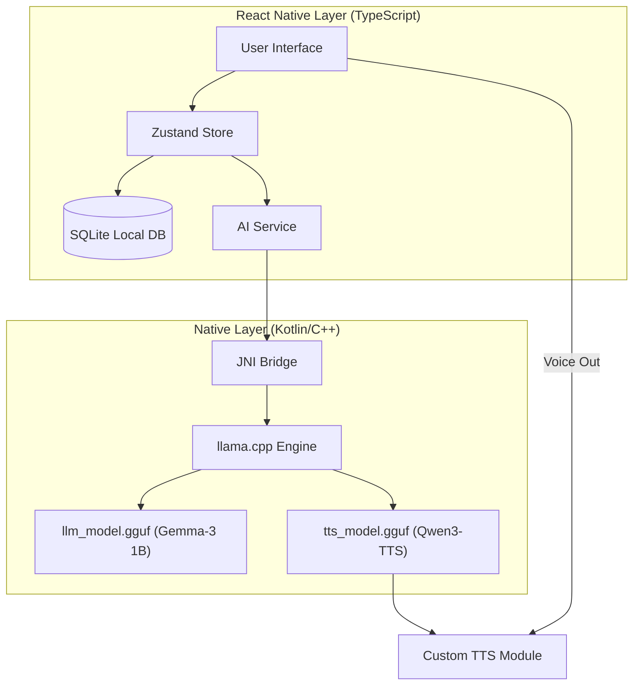

# AI-Diary (AI日記) 🤖📔

<p align="center">
  
</p>


> **Produced by Clover Next**
> 
> プライバシー重視の、完全オフライン対応エモーショナル日記アプリ。
> インターネットにデータを送信することなく、あなたのデバイス上でAIが寄り添います。

---

## 🌟 プロジェクト概要
「AI-Diary」は、日々の感情を記録し、AI（ローカルLLM）との対話を通じて自分自身を客観的に見つめ直すための次世代日記アプリです。
最先端のオンデバイスAI技術を駆使し、究極のプライバシーとリアルタイムな対話体験を両立しました。

### ✨ 主要機能
- **🧠 完全オフライン推論 (Gemma-3 1B)**
  - 外部サーバーを一切使用せず、デバイス内でAIが思考します。あなたの秘密は完全に守られます。
- **🎙️ エモーショナル音声対話 (Qwen3-TTS)**
  - 「Ono_Anna」ボイスによる、温かみのある音声合成。テキストだけでなく、耳からも癒やしを。
- **📊 感情のカレンダー・ビジュアライズ**
  - その日の気分を色とアイコンで記録。過去の自分を美しく振り返ることができます。
- **🔐 プライバシー・ファースト**
  - 全ての履歴はローカルのSQLiteデータベースにのみ保存されます。

---

## 🏗 システム構成
「AI-Diary」は多層的なアーキテクチャで構成されており、React Nativeによる俊敏なUIと、C++ (llama.cpp) による強力な演算を組み合わせています。



---

## 🛠 技術スタック
| カテゴリ | 技術 |
| :--- | :--- |
| **Framework** | React Native (Expo) |
| **Language** | TypeScript |
| **AI Engine** | native `llama.cpp` (Android JNI Bridge) |
| **LLM Model** | Gemma-3 1B IT (Quantized INT4) |
| **TTS Model** | Qwen3-TTS 0.6B |
| **Database** | SQLite (expo-sqlite) |
| **State** | Zustand |

---

## 🚀 クイックスタート

### 1. リポジトリのクローンとインストール
```bash
git clone https://github.com/clover-next/ai-diary.git
cd ai-diary
npm install
```

### 2. ネイティブバイナリの生成 (Android)
```bash
npx expo prebuild
```

### 3. AIモデルの準備
本リポジトリにはAIモデル本体は含まれていません（GitHubのファイルサイズ制限のため）。
アプリ内のセットアップ画面で自動ダウンロードされるか、手動で **[Releases](https://github.com/clover-next/ai-diary/releases)** からダウンロードして `models/` ディレクトリに配置してください。

```bash
setup_models.bat
```

---

## ⚖️ 免責事項・著作権
- 本ソフトウェアおよびデザインの著作権は **Clover Next** に帰属します。
- 使用されている各AIモデルの著作権は、それぞれの開発元（Google, Alibaba等）に帰属します。
- 本アプリは医療機器ではなく、カウンセリングの代替を意図したものではありません。

---
<p align="center">
  <b>Clover Next - 未来を拓く、穏やかなテクノロジー</b><br>
  Copyright © 2026 Clover Next All Rights Reserved.
</p>
